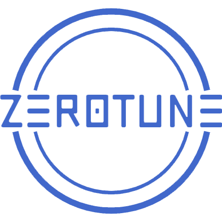

<h1 align="center">
  
   Welcome to ZeroTune - Code and Documentation
</h1>

ZeroTune is a novel zero-shot learned approach for determining cost effective parallelism degrees in distributed stream processing system.

<h3>Dedicated Repository for Paper Submission:</h3>

This repository is created to support our paper submission titled "ZeroTune", showcasing the capabilities of zero-shot model.

<h3> Exploring ZeroTune's Key Components:</h3>

- [zerotune-management:](https://github.com/pratyushagnihotri/ZeroTune/tree/master/zerotune-management#readme) The main instructions to setup is in zerotune-management. It consists collection of scripts that facilitate the seamless setup of both local and remote clusters. These clusters serve as the foundation for the parallel query plan generator and environment for zero-shot model for training and test purpose.

- [zerotune-plan-generator:](https://github.com/pratyushagnihotri/ZeroTune/tree/master/zerotune-plan-generation#readme) Apache flink client application which functions as an essential tool for generating synthetic and benchmark parallel query plans. These plans are vital for the training and testing of data, a crucial aspect of our zero-shot learning model.

- [zerotune-learning:](https://github.com/pratyushagnihotri/ZeroTune/tree/master/zerotune-learning/flink_learning#readme) zero-shot model that specializes in providing accurate cost predictions for distributed parallel stream processing.

- [Flink-Observation:](https://github.com/pratyushagnihotri/ZeroTune/tree/master/flink-observation#readme) Modified the fork of Apache Flink for custom logging of observation of workload characteristics and loggin them in MongoDB database.

- [zerotune-VM_image:](https://github.com/pratyushagnihotri/ZeroTune/tree/master/zerotune-virtualbox-image#readme) VM image includes all the necessary code and dependencies that are required to generate training data and training of the model. 
